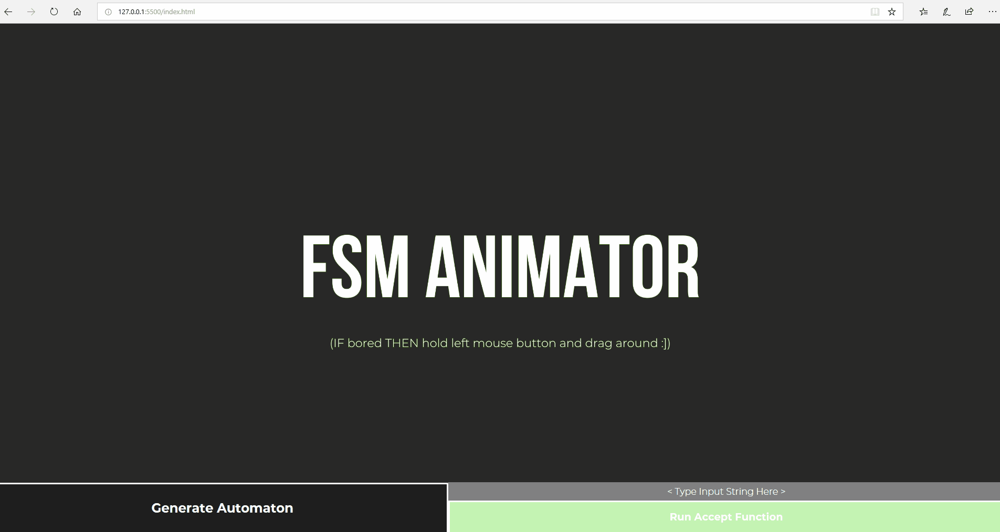

# Finite State Machines - Generator & Interactive Visualiser
A front-end application that generates, displays and animates theoretical Finite State Machines.

**Features**:
- Generation of DFA, NFA and E-NFA
- Interactive visualisation of the FSMs.
- Animation of the accept algorithm for the FSMs.
- Configurable canvas.
- Storage of past FSM objects.

## Try the application

## Media

